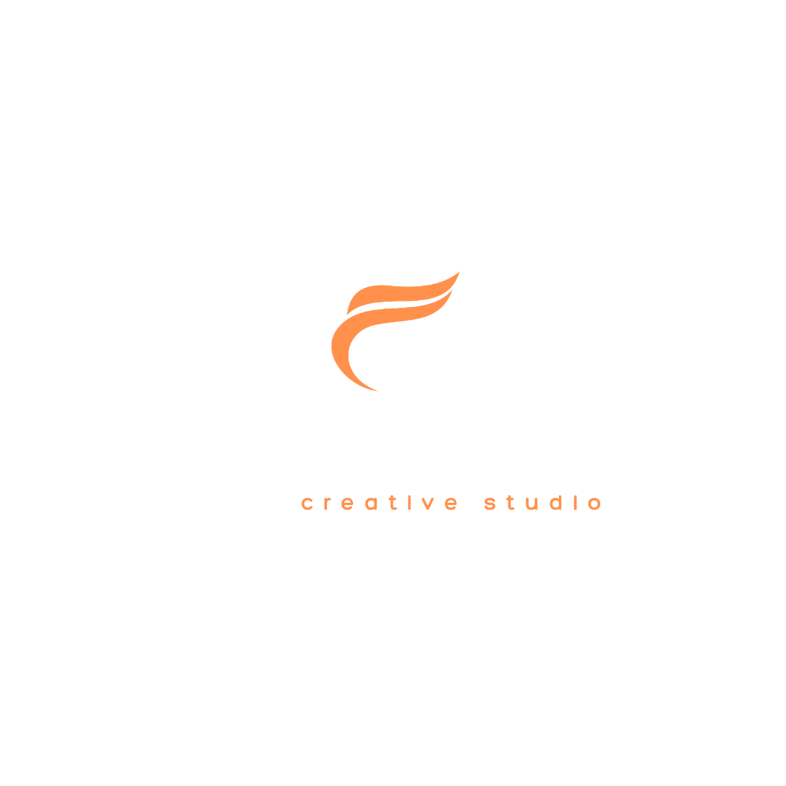

# Figment Studio

> **Premium Architectural Visualization** ΓÇö Nigeria's leading 3D rendering, cinematic animation, and AI-guided design studio.



---

## Tech Stack

| Layer | Technology |
|---|---|
| Frontend | Vite + React 19 + TypeScript |
| Styling | TailwindCSS (CDN config) + custom design system |
| State | Zustand (persisted) |
| AI | Google Gemini 2.5 Flash/Pro via backend proxy |
| Backend | Express + Node.js |
| Fonts | Cormorant Garamond (display) + Inter (body) |

---

## Getting Started (Localhost)

### Prerequisites
- Node.js 18+
- npm

### 1. Frontend

```bash
# Install dependencies
npm install

# Set up environment
# Create .env.local:
# VITE_BACKEND_URL=http://localhost:8787

# Start dev server (port 3005)
npm run dev
```

### 2. Backend

```bash
cd backend

# Install dependencies
npm install

# Set up environment
# Edit .env:
# PORT=8787
# GEMINI_API_KEY=your_key_here
# FX_USD_NGN=1600
# PAYSTACK_CHECKOUT_URL=
# FLUTTERWAVE_CHECKOUT_URL=

# Start backend (port 8787)
npm run dev
```

### Open the app
- **Frontend:** http://localhost:3005
- **Backend API:** http://localhost:8787/api/health

---

## Project Structure

```
figment-studio/
Γö£ΓöÇΓöÇ components/          # 33 React UI components
Γöé   Γö£ΓöÇΓöÇ Logo.tsx         # Brand logo (uses /public/logo.png)
Γöé   Γö£ΓöÇΓöÇ Header.tsx       # Sticky nav with mobile drawer
Γöé   Γö£ΓöÇΓöÇ Footer.tsx       # Dark footer with nav columns
Γöé   Γö£ΓöÇΓöÇ Hero.tsx         # Full-bleed hero with stats bar
Γöé   Γö£ΓöÇΓöÇ LandingPage.tsx  # Landing + pricing + CTA
Γöé   Γö£ΓöÇΓöÇ ArcVizPage.tsx   # AI Studio workspace
Γöé   Γö£ΓöÇΓöÇ PaymentPortal.tsx# Paystack/Flutterwave checkout
Γöé   Γö£ΓöÇΓöÇ AdminDashboard.tsx
Γöé   Γö£ΓöÇΓöÇ ClientDashboard.tsx
Γöé   ΓööΓöÇΓöÇ ...
Γö£ΓöÇΓöÇ services/
Γöé   ΓööΓöÇΓöÇ geminiService.ts # Gemini AI streaming service
Γö£ΓöÇΓöÇ store.ts             # Zustand global state
Γö£ΓöÇΓöÇ types.ts             # TypeScript interfaces
Γö£ΓöÇΓöÇ constants.ts         # Images, mock data
Γö£ΓöÇΓöÇ public/
Γöé   ΓööΓöÇΓöÇ logo.png         # Official Figment Studio logo
Γö£ΓöÇΓöÇ backend/
Γöé   Γö£ΓöÇΓöÇ server.js        # Express API server
Γöé   Γö£ΓöÇΓöÇ .env             # Backend environment variables
Γöé   ΓööΓöÇΓöÇ .env.example     # Template for env setup
ΓööΓöÇΓöÇ index.html           # Global design system (Tailwind config)
```

---

## Roadmap (7-Phase Plan)

- **Phase 1** ΓÇö Config hygiene, server-side AI proxy, telemetry
- **Phase 2** ΓÇö Real auth (JWT), Postgres DB, protected routes
- **Phase 3** ΓÇö Live payment infrastructure (webhooks + reconciliation)
- **Phase 4** ΓÇö AI Studio v1 (presets, history, structured outputs)
- **Phase 5** ΓÇö Sketch preservation + quality gates
- **Phase 6** ΓÇö Premium plans, AI credits, concierge delivery
- **Phase 7** ΓÇö Security hardening, E2E tests, launch

---

## Design System

Color palette anchored to the official brand orange:

| Token | Value | Use |
|---|---|---|
| `primary` | `#F07A3A` | Brand orange, CTAs, accents |
| `canvas-dark` | `#100D0A` | Dark panels, footer |
| `text-main` | `#0F0D0B` | Primary text |
| `surface` | `#FFFFFF` | Card backgrounds |
| `background` | `#F9F6F2` | Page background |

Fonts: **Cormorant Garamond** (display/headlines) + **Inter** (body/UI)

---

© 2025 Figment Studio Ltd. Abuja, Nigeria.
